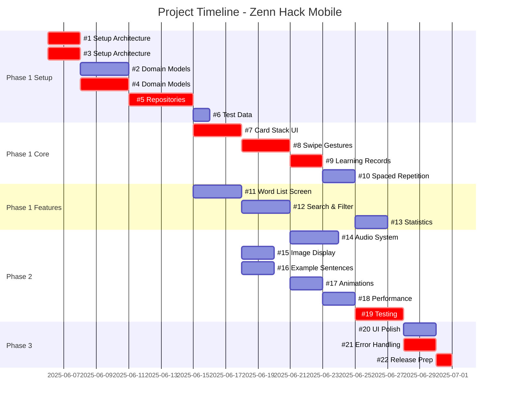

# PERT Diagram - Zenn Hack Mobile Project

## Critical Path Analysis

**Critical Path**: #1 → #3 → #4 → #5 → #7 → #8 → #9 → #19 → #21 → #22  
**Total Duration**: 28 days (minimum project duration)

## PERT Network Diagram

```mermaid
graph LR
    %% Start node
    Start([Start]) --> Issue1[#1 Setup<br/>2d]
    Start --> Issue3[#3 Setup<br/>2d]
    
    %% Phase 1 - Week 1
    Issue1 --> Issue2[#2 Models<br/>3d]
    Issue3 --> Issue4[#4 Models<br/>3d]
    Issue2 --> Issue5[#5 Repositories<br/>4d]
    Issue4 --> Issue5
    
    Issue5 --> Issue6[#6 Test Data<br/>1d]
    
    %% Phase 1 - Week 2
    Issue5 --> Issue7[#7 Card UI<br/>3d]
    Issue7 --> Issue8[#8 Swipe<br/>3d]
    Issue5 --> Issue9[#9 Learning<br/>2d]
    Issue9 --> Issue10[#10 Algorithm<br/>2d]
    Issue8 --> Issue9
    
    %% Phase 1 - Week 3
    Issue5 --> Issue11[#11 Word List<br/>3d]
    Issue11 --> Issue12[#12 Search<br/>3d]
    Issue9 --> Issue13[#13 Statistics<br/>2d]
    Issue10 --> Issue13
    
    %% Phase 2 - Enhancement
    Issue8 --> Issue14[#14 Audio<br/>3d]
    Issue7 --> Issue15[#15 Images<br/>2d]
    Issue11 --> Issue16[#16 Examples<br/>2d]
    Issue8 --> Issue17[#17 Animation<br/>2d]
    
    Issue14 --> Issue18[#18 Performance<br/>2d]
    Issue15 --> Issue18
    Issue16 --> Issue18
    Issue17 --> Issue18
    
    %% Testing
    Issue10 --> Issue19[#19 Testing<br/>3d]
    Issue12 --> Issue19
    Issue13 --> Issue19
    Issue18 --> Issue19
    
    %% Phase 3 - Polish
    Issue19 --> Issue20[#20 UI Polish<br/>2d]
    Issue19 --> Issue21[#21 Error<br/>2d]
    
    Issue20 --> Issue22[#22 Release<br/>1d]
    Issue21 --> Issue22
    
    %% End node
    Issue22 --> End([End])
    
    %% Critical path highlighting
    classDef critical fill:#ff6b6b,stroke:#c92a2a,stroke-width:3px,color:#fff
    classDef normal fill:#4dabf7,stroke:#339af0,stroke-width:2px,color:#fff
    classDef start fill:#51cf66,stroke:#2f9e44,stroke-width:2px,color:#fff
    classDef end fill:#ffd43b,stroke:#fab005,stroke-width:2px,color:#000
    
    class Issue1,Issue3,Issue4,Issue5,Issue7,Issue8,Issue9,Issue19,Issue21,Issue22 critical
    class Issue2,Issue6,Issue10,Issue11,Issue12,Issue13,Issue14,Issue15,Issue16,Issue17,Issue18,Issue20 normal
    class Start start
    class End end
```

## Gantt Chart View



## Dependency Matrix

| Issue | Dependencies | Estimated Time | Priority | Phase |
|-------|-------------|----------------|----------|--------|
| #1 | None | 2 days | High | Phase 1 |
| #2 | #1 | 3 days | High | Phase 1 |
| #3 | None | 2 days | High | Phase 1 |
| #4 | #3 | 3 days | High | Phase 1 |
| #5 | #2, #4 | 4 days | High | Phase 1 |
| #6 | #5 | 1 day | Medium | Phase 1 |
| #7 | #5 | 3 days | High | Phase 1 |
| #8 | #7 | 3 days | High | Phase 1 |
| #9 | #5, #8 | 2 days | High | Phase 1 |
| #10 | #9 | 2 days | High | Phase 1 |
| #11 | #5 | 3 days | High | Phase 1 |
| #12 | #11 | 3 days | Medium | Phase 1 |
| #13 | #9, #10 | 2 days | Medium | Phase 1 |
| #14 | #8 | 3 days | High | Phase 2 |
| #15 | #7 | 2 days | Medium | Phase 2 |
| #16 | #11 | 2 days | Medium | Phase 2 |
| #17 | #8 | 2 days | Medium | Phase 2 |
| #18 | #14, #15, #16, #17 | 2 days | High | Phase 2 |
| #19 | #10, #12, #13, #18 | 3 days | High | Phase 2 |
| #20 | #19 | 2 days | Medium | Phase 3 |
| #21 | #19 | 2 days | High | Phase 3 |
| #22 | #20, #21 | 1 day | Medium | Phase 3 |

## Slack Time Analysis

### Zero Slack (Critical Path):
- #1, #3, #4, #5, #7, #8, #9, #19, #21, #22

### Issues with Slack Time:
- #2: 2 days slack
- #6: Can be done anytime after #5
- #10: 5 days slack
- #11: 8 days slack
- #12: 5 days slack
- #13: 3 days slack
- #14: 5 days slack
- #15: 10 days slack
- #16: 6 days slack
- #17: 8 days slack
- #18: 3 days slack
- #20: 1 day slack

## Resource Allocation Recommendations

### Parallel Work Opportunities:
1. **Week 1**: #1 and #3 can start simultaneously
2. **Week 1-2**: #2 and #4 can be developed in parallel
3. **Week 2**: #11 can start while #7 is being developed
4. **Week 3**: #14, #15, #16, #17 can all be worked on in parallel
5. **Testing**: Unit tests can be written alongside feature development

### Risk Mitigation:
- Focus resources on critical path items first
- Use slack time for code reviews and documentation
- Start #19 (Testing) incrementally throughout development
- Keep #6 (Test Data) ready early to unblock UI development

## Milestone Checkpoints

1. **Day 5**: Architecture setup complete (#1, #3)
2. **Day 8**: Domain models complete (#2, #4)
3. **Day 12**: Data layer complete (#5)
4. **Day 15**: Basic UI functional (#7)
5. **Day 18**: Core features working (#8, #9)
6. **Day 23**: All features implemented (#10-#18)
7. **Day 26**: Testing complete (#19)
8. **Day 28**: Release ready (#22)